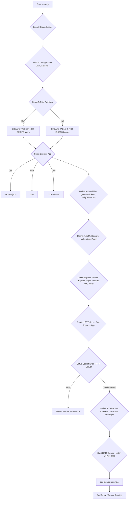
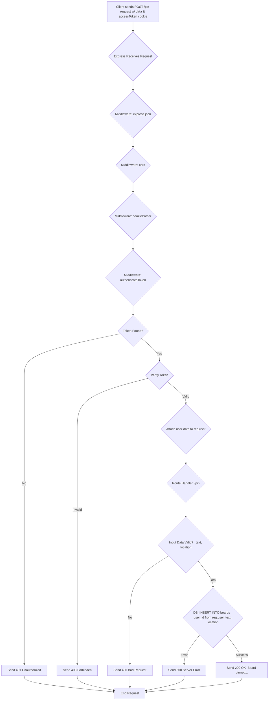
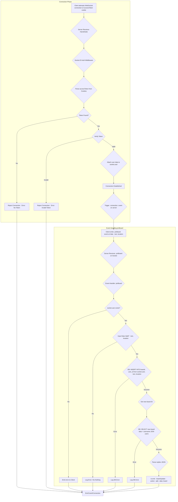
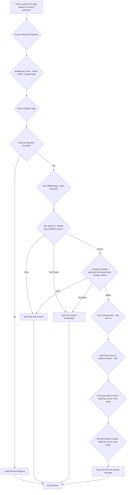

**1. Server Initialization and Setup**

**2. HTTP Request Flow   Example: POST /pin  **

**3. WebSocket Connection and Event Flow   Example:  pinBoard  event  **

**4. User Authentication Flow   Example: POST /login  **

